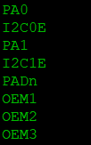

# Soteria Gen3 secure-boot library application project

This application demonstrates the Soteria Gen3 secure-boot solution.

## Description

This example demonstrates the Soteria Gen3 secure-boot solution. This project is meant to be run on the CEC173x development board containing valid AP_FW and EC_FW images. All AP_FW images are authenticated and in case of any issues, the MEC1723 device (Application Processor) is held in reset. On a successfull boot, the MEC1723 device is released from reset and allowed to run code from PVT_SPI_FLASH (or) QSPI0_SPI_FLASH (or) QSPI1_SPI_FLASH.

## Downloading and building the application

To clone or download this application from Github, go to the [main page of this repository](https://github.com/Microchip-MPLAB-Harmony/core_apps_cec173x) and then click **Clone** button to clone this repository or download as zip file.
This content can also be downloaded using content manager by following these [instructions](https://github.com/Microchip-MPLAB-Harmony/contentmanager/wiki).

Path of the application within the repository is **apps/sg3_h3_port/firmware** .

To build the application, refer to the following table and open the project using its IDE.

| Project Name      | Description                                    |
| ----------------- | ---------------------------------------------- |
| sg3_h3_port.X     | MPLABX project for [CEC 1736 Evaluation Board](https://www.microchip.com/DevelopmentTools/ProductDetails/)     |
|||

## Setting up the hardware

The following table shows the target hardware for the application projects.

| Project Name| Board|
|:---------|:---------:|
| sg3_h3_port.X | MPLABX project for [CEC 1736 Evaluation Board](https://www.microchip.com/DevelopmentTools/ProductDetails/)     |
|||

### Setting up [CEC 1736 Evaluation Board](https://www.microchip.com/DevelopmentTools/ProductDetails/)

- Connect the Debug USB port on the board to the computer using a micro USB cable
- Connect the USB port P2 on the board to the computer using a micro USB cable
- Connect pin 1 of J36 with pin 2 of J36
- Connect pin 2 of J36 with pin 3 of J36

## Running the Application

1. Open the Terminal application (Ex.:Tera term) on the computer
2. Connect to the Virtual COM port and configure the serial settings as follows:
    - Baud : 115200
    - Data : 8 Bits
    - Parity : None
    - Stop : 1 Bit
    - Flow Control : None
3. Build and Program the application using its IDE
4. The console displays the following message

    
5. LED12 will toggle at 0.5Hz frequency after step #4 and toggle at 2Hz frequency before step #4
6. Please refer https://github.com/Microchip-MPLAB-Harmony/CEC173x_soteria_lib/docs/cec173x_soteria_mcc_getting_started.pdf for API usage and complete list of outputs that can be observed on the development board
7. The following table provides the LED names

| Board      | LED Name                                    |
| ----------------- | ---------------------------------------------- |
| [CEC 1736 Evaluation Board](https://www.microchip.com/DevelopmentTools/ProductDetails/) |LED12 |
| [CEC 1736 Evaluation Board](https://www.microchip.com/DevelopmentTools/ProductDetails/) |LED5 |
| [CEC 1736 Evaluation Board](https://www.microchip.com/DevelopmentTools/ProductDetails/) |LED6 |
|||
